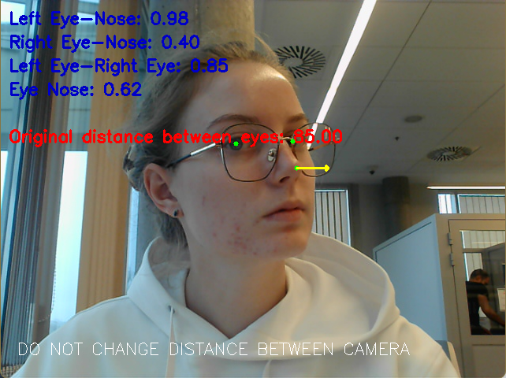
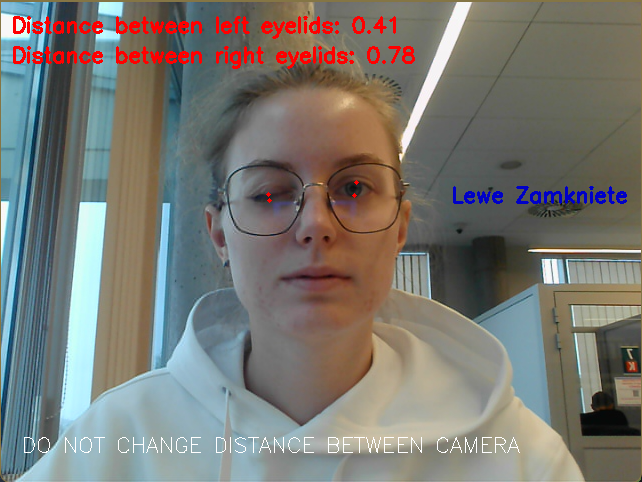

# Obsluga-komputera-z-pomoca-motoryki-glowy-i-mimiki-twarzy

## Opis Projektu
Celem niniejszej pracy jest opracowanie programu umożliwiającego obsługę komputera bez konieczności używania rąk. Projekt skierowany jest do osób z niepełnosprawnościami kończyn górnych.

Program wykorzystuje zaawansowane technologie przetwarzania obrazu oraz sztuczną inteligencję do detekcji twarzy, analizy orientacji głowy i mimiki twarzy, rozpoznawania mowy oraz sterowania kursorem myszy.

## Spis Treści
- [Algorytm Działania Programu](#algorytm-działania-programu)
- [Konfiguracja](#konfiguracja)
- [Kalibracja](#kalibracja)
- [Sterowanie Kursorem](#sterowanie-kursorem)
- [Klikanie](#klikanie)
- [Scrollowanie](#scrollowanie)
- [Rozpoznawanie Mowy](#rozpoznawanie-mowy)
- [Testy i Wyniki](#testy-i-wyniki)
- [Podsumowanie](#podsumowanie)

## Algorytm Działania Programu
Program przetwarza dane wejściowe w formie obrazów uzyskanych z kamery internetowej (30 klatek na sekundę). Obraz jest przekazywany do modelu AI, który wykrywa twarz i wyznacza maskę punktów charakterystycznych. Na podstawie tych punktów analizowane są ruchy głowy oraz mimika twarzy, obsługiwana jest również detekcja głosu, co pozwala na "pisanie". Do nałożenia siatki punktów wykorzystano bibliotekę mediapipe, do detekcji mowy bibliotekę vosk.


## Konfiguracja
Przed rozpoczeciem pracy należy skonfigurować model do rozpoznawania twarzy oraz model do rozpoznawania głosu.

```python
mp_face_mesh = mp.solutions.face_mesh
face_mesh = mp_face_mesh.FaceMesh(
    min_detection_confidence=0.5,
    min_tracking_confidence=0.5,
    refine_landmarks=True
)
```

```python
model = vosk.Model(self.model_path)
self.rec = vosk.KaldiRecognizer(model, 16000)
p = pyaudio.PyAudio()
self.stream = p.open(format=pyaudio.paInt16, channels=1, rate=16000, input=True, frames_per_buffer=4096)
```


## Kalibracja
Kalibracja umożliwia dostosowanie programu do indywidualnej budowy twarzy użytkownika. Proces trwa 4 sekundy i polega na zapisaniu odległości pomiędzy kluczowymi punktami na twarzy, do których następnie odwołujemy się w programie. Ważne jest aby podczas kalibracji pozostawać bez ruchu i po jej zakończeniu nie zmieniać odległości od kamery.


## Sterowanie Kursorem
Ruch kursora jest określany na podstawie odległości między oczami i nosem oraz ich zmienności w czasie.

```python
def calculate_look_vector(D_left_eye_nose, D_right_eye_nose, D_left_right_eye, org_eyes_nose, avg):
    if avg != 0:
        look_vector = (0, 0)
        if (D_left_eye_nose > 0.9 and D_left_right_eye <= 1):
            look_vector = (10, 0)
        elif (D_right_eye_nose > 0.9 and D_left_right_eye <= 1):
            look_vector = (-10, 0)
        return look_vector
```

Progi zostały dostosowane eksperymentalnie.




## Klikanie
Klikanie jest realizowane poprzez analizę zamknięcia oczu użytkownika. Aby zapobiec przypadkowym kliknięciom określono minimalną ilość czasu, jaką oko musi być zamknięte aby wykonać akcję kliknięcia. Dodatkowo długie zamknięcie lewego oka powoduje wejście w tryb zaznaczania (informacja wyświetla się na obrazie z kamery).

```python
def open_close(right_eyelid_D, left_eyelid_D, avg_left, avg_right):
    re_D = right_eyelid_D / avg_right
    le_D = left_eyelid_D / avg_left
    return [re_D < 0.5, le_D < 0.5]
```
Progi zostały dostosowane eksperymentalnie.



## Scrollowanie
Scrollowanie realizowane jest poprzez analizę mimiki twarzy a dokładnie odległości między kącikami ust i wargami. Do scrollowania wykorzystano uśmiech i zdziwienie.

```python
def analyze_smile(mouth_endings_distance, mouth_lips_distance, avg_w, avg_h):
    if avg_w != 0 and avg_h != 0:
        if mouth_endings_distance / avg_w > 1.3 and mouth_lips_distance / avg_h < 1.5:
            return "Smile"
        elif mouth_lips_distance / avg_h > 2.5:
            return "Shock"
        else:
            return "Neutral"
```


## Rozpoznawanie Mowy
System przechodzi w tryb rozpoznawania mowy po umieszczeniu kursora w lewym górnym rogu ekranu. Model przekształca mowę na tekst i wprowadza go do systemu.

```python
def start_rec(self):
    with open(self.output_text_file, "w") as output_file:
        while True:
            data = self.stream.read(4096)
            if self.rec.AcceptWaveform(data):
                result = json.loads(self.rec.Result())
                recognized_text = result['text']
                if "stop" in recognized_text.lower():
                    break
```


## Testy i Wyniki

### Sterowanie kursorem
Do stwierdzenia poprawności działania programu oraz jego skuteczności utworzono test polegający na
śledzeniu wygenerowanej losowo ścieżki.

Zadaniem testera było prześledzenie zadanej trasy z dokładnością większą niż 90 % w jak najkrótszym
czasie. Test został przeprowadzony na różnych osobach, w różnych warunkach, wykorzystując zarówno
utworzony program, jak i touch pad.


Wyniki uzyskane podczas testów zdecydowanie wskazują na korzyść sterowania klasycznego za pomocą
touchpada. Wyniki te są zgodne z przewidywaniami ze względu na charakter utworzonego narzędzia.
Przyczyn takich wyników jest wiele, oto kilka z nich:

• Inna specyfika pracy - Obsługa kursora za pomocą ruchów głowy była czymś nowym dla osób
testujących. Pomimo poprzedzającego test zapoznania ze sterowaniem, nadal była to czynność
wykonywana nieporównywalnie rzadziej niż sterowanie klasyczne, z którym mamy do czynienia
praktycznie codziennie.

• Zakłócenia zewnętrzne - Wynikają z czynników takich jak niezamierzone ruchy, zmęczenie
użytkownika, zmienne tło, problemy techniczne, różnice indywidualne oraz błędy kalibracji, takie jak
zmiana pozycji. Te czynniki obniżają precyzję i efektywność sterowania, wydłużając w ten sposób
czas wykonania zadania.

• Płynność ruchów - Aby ruchy kursora nie były powolne kursor jest przemieszczany o minimalną
odległość 10 px, co w połączeniu z za długim przytrzymaniem głowy w pozycji pozwalającej na
wyznaczenie wektora sterowania doprowadza do wyjechania poza ustaloną ścieżkę i często trudności
z powrotem na nią.

Drugim etapem testów było porównanie sterowania w różnych odległościach od kamery i różnym
oświetleniu. Pomimo tego, że wyniki niejednoznacznie wskazują na najlepszą odległość od kamery, to
wyniki uzyskane w świetle naturalnym były zauważalnie najlepsze. Należy również zaznaczyć, że testy
były wykonywane w różne dni i doświadczenie użytkownika w trakcie testów się zmieniało, przez co testy
wykonywane w gorszych warunkach ale później nie odbiegają znacznie wynikami. Pomimo tego podczas
obserwacji przebiegu testów i na bazie własnych doświadczeń jesteśmy w stanie skonstruować następujące
wnioski:

• Oświetlenie - Powinno być dostosowane tak, aby twarz nie była prześwietlona ani zaciemniona,
należy unikać zakłóceń, takich jak migotanie światła.

• Tło - Użytkownik powinien zadbać o statyczne tło, np. ścianę. Najlepiej unikać poruszania się
innych osób bądź obiektów za użytkownikiem.

• Ustawienie kamery - Najlepsze wyniki są uzyskiwane, gdy kamera znajduje się na wysokości
oczu, tak by cała twarz mieściła się w obrazie zostawiając jednocześnie trochę przestrzeni na tło, by
wykonując ruchy nie znikać z pola widzenia kamery.

Aby poprawić wyniki sterowania głową, można zastosować kilka usprawnień, które obejmują zarówno
technologię, jak i sposób korzystania z systemu. Przede wszystkim, system powinien być wyposażony
w bardziej precyzyjne algorytmy śledzenia ruchu, które eliminują błędy spowodowane niezamierzonymi
ruchami. Można także użyć lepszego sprzętu, na przykład kamer o wyższej rozdzielczości. Warto pamiętać,
że najważniejszym czynnikiem decydującym o prędkości działania programu jest wprawa użytkownika.
Dlatego wyników uzyskanych w zarówno pierwszej, jak i drugiej fazie testów nie można z pełnym
przekonaniem traktować jako miarodajnych, ze względu na wykonywanie ich po różnym czasie użytkowania.

### Detekcja mowy
Do sprawdzenia dokładności modelu rozpoznawania głosu przygotowano dwa teksty. Pierwszy tekst
zawiera słowa często używane w życiu codziennym, natomiast w drugim występują słowa bardziej
zaawansowane, lecz wciąż zrozumiałe dla ogółu. Celem tego rozdziału na dwa teksty jest przetestowanie
modelu pod względem stopnia zaawansowania słownictwa.

Do roli mówców wykorzystano darmowe syntezatory ze strony producenta ElevenLabs. Aby zapewnić
różnorodność częstotliwości podstawowych w głosach nadawców, wybrano trzy różne syntezatory głosów
męskich oraz kobiecych. Ponadto wykorzystanie syntezatorów zapewnia stabilność amplitudową sygnału
w otoczeniu punktu pracy.

Model rozpoznawania głosu był testowany dla różnych głosów w różnych środowiskach. Środowiska
wyróżniały się intensywnością zakłóceń, które symulowane były szumem białym o stałej amplitudzie.
Średnie wzmocnienie sygnałów głosowych wynosiło -28dB, a przy testach środowiska zaszumionego
stosowano wzmocnienie szumu białego na poziomie -43dB oraz -33dB. Poniżej zamieszczone są teksty, na
których model był testowany. Analiza wyników skupiała się na poprawnie wykrytym słowie oraz czy dane
słowo zostało wykryte w odpowiednim czasie w zdaniu


Otrzymane pomiary wskazują na kluczową rolę charakteru otoczenia, w którym model funkcjonuje.
Im amplituda szumu jest bliższa amplitudzie sygnału właściwego, tym częściej model będzie wykrywał
błędne słowa. Szum biały obejmuje pełny zakres częstotliwości słyszalnych dla człowieka, więc model
będący pod wpływem zakłócenia o takim charakterze zacznie wykrywać w pewnym sensie losowe słowa.
Im mniejszy jest współczynnik SNR, tym gorsza będzie jakość wykrywania słów.

Dla wykorzystanego modelu największymi problemami okazały się polskie znaki diakrytyczne (tj. ą, ę)
na końcu słów oraz niewielkie różnice fonetyczne między wyrażeniami np. park i bark, pies i więc.
Opierając się na tabelach należy zauważyć, że model z powodzeniem wykrywa słowa
wszystkich syntezatorów głosu naturalnego, poza Charlotte. Głos syntezatora Charlotte charakteryzuje
się znacznym (dla modelu) spadkiem amplitudy sygnału na ostatniej sylabie wyrazu, co wpływa
na prawdopodobieństwo wystąpienia danego fonemu, tym samym na prawdopodobieństwo wykrycia
poprawnego słowa.

Różnice między dokładnościami wykrycia tekstów1 oraz tekstów2 są marginalne i nie dostarczają
wystarczającej informacji o stopniu zaawansowania słownika wybranego modelu języka polskiego.
Dane przedstawiają dokładność modelu dla różnych syntezatorów, gdy różnica między wzmocnieniem
szumu a wzmocnieniem sygnału właściwego wynosi 5 dB. Ze względu na znaczącą rolę szumu w całym
sygnale zaczęły pojawiać się błędy, które kaskadowo przyczyniały się do powstawania kolejnych. Jest to
naturalne zachowanie w algorytmie, który do przyszłego wyniku wykorzystuje przeszłe próbki.

## Podsumowanie
Celem niniejszej pracy było opracowanie programu, który umożliwi obsługę komputera bez konieczności
użycia rąk, co ma szczególne znaczenie dla osób z niepełnosprawnościami kończyn górnych. We
współczesnych czasach jest to szczególnie istotne, kiedy coraz więcej aktywności poddaje się procesowi
cyfryzacji. W ramach realizacji tego celu program wykorzystuje nowoczesne technologie z zakresu
przetwarzania obrazów oraz sztucznej inteligencji. Podstawowe założenia projektu obejmowały detekcję
twarzy, analizę orientacji głowy i mimiki twarzy, rozpoznawanie mowy, korelację wyników analizy z ruchem
i funkcjami kursora oraz rozpoznawanie głosu i konwersję na tekst.

Praca miała na celu stworzenie zintegrowanego rozwiązania, które ułatwi osobom z niepełnosprawnościami
korzystanie z komputera w sposób intuicyjny i niezależny.

Podsumowując, udało się zrealizować założone cele. Kluczową rolę w projekcie odgrywały biblioteki
Vosk oraz Mediapipe, umożliwiające wykorzystanie wytrenowanych modeli rozpoznawania mowy oraz
twarzy. Rozpoznana twarz wraz z nałożoną na nią siatką punktów pozwoliła na znalezienie zależności
między punktami charakterystycznymi a orientacją głowy i mimiką twarzy. Rozpoznany głos i słowa dały
możliwość pisania tekstów bez konieczności użycia klawiatury.

Aby program mógł być uniwersalnym narzędziem, zaprojektowano proces kalibracyjny, który zapisywał
punkty charakterystyczne użytkownika i uśredniał je. Te średnie wartości stały się kluczowe do ustalenia
progów wykorzystywanych przy detekcji zmiany orientacji głowy i mimiki twarzy.

W przyszłości można rozszerzyć funkcjonalność o analogowe sterowanie wektorem ruchu oraz poprawić algorytmy detekcji dla większej precyzji.

---
Autor: [Julia Wałowska, Damian Zieliński]

